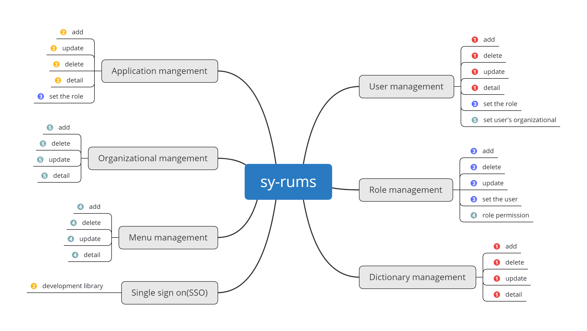

# sy-rums [授渔通用权限管理系统]
## 功能

## 依赖开发库
|组件名称|版本|官网|
|------|-------|------|
|springboot|2.5.6|[https://start.spring.io/](https://start.spring.io/)|
|Apache Shiro|2.0.0-SNAPSHOT|[https://github.com/apache/shiro](https://github.com/apache/shiro)|

